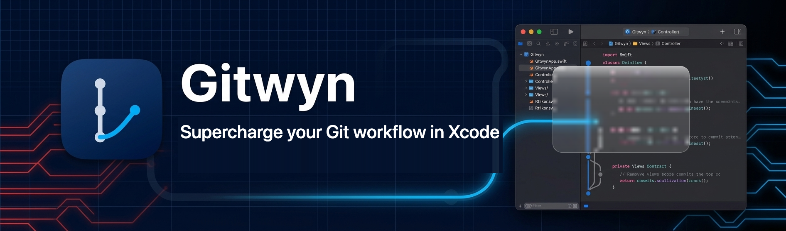
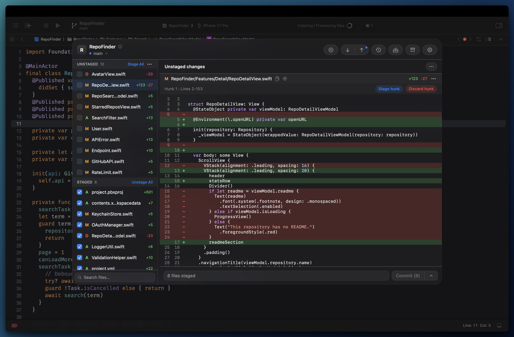
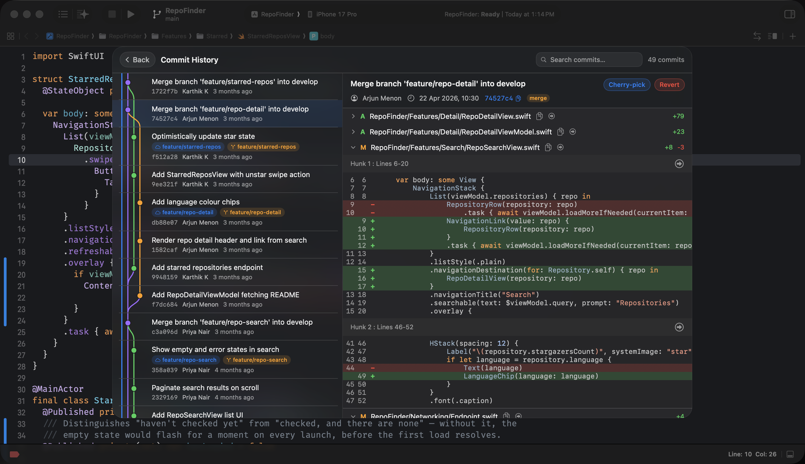
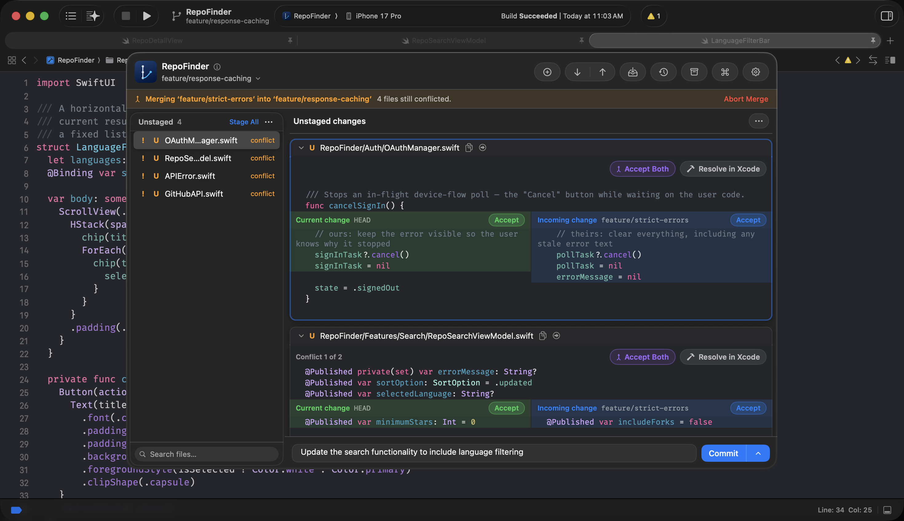
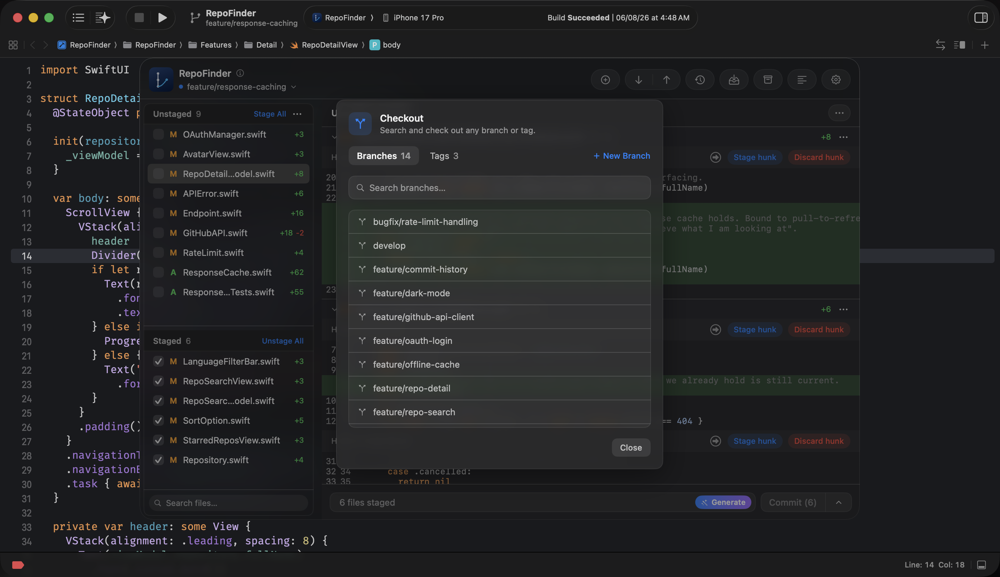
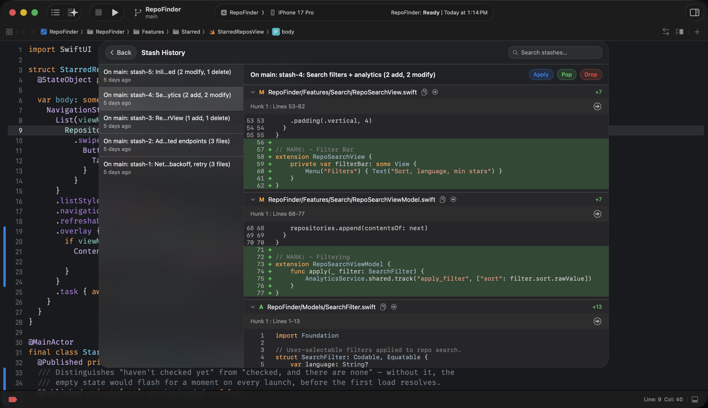

  

---

# Supercharge Git workflow in Xcode

A native macOS Git client for Xcode — the Git overlay that opens right beside your code,
with the Git tools Xcode always needed.

 

 

**[gitwyn.com](https://gitwyn.com)** · Free to use · requires macOS 26 or later

---

## Work with Git without leaving Xcode

Press <kbd>⌘</kbd> <kbd>⇧</kbd> <kbd>E</kbd> in any Xcode window to get started.

Gitwyn automatically detects the Git repository, files and changes in your active Xcode
project — always in context, so you never have to leave Xcode or alt-tab to a separate
Git client.

---

## ✨ Features

* **100% Native macOS App** — Built specifically for macOS and Xcode, ensuring high performance, low memory usage, and native UI feel.
* ✍️ **AI Commit Messages** — Press Generate and Gitwyn drafts the message from what you actually staged, using Apple Intelligence on your own Mac. No API key, no account, and the diff never leaves the machine.
* 🛠 **Seamless Xcode Integration** — Triggered instantly with a hotkey, opening directly on top of your active Xcode project. Gitwyn automatically detects the current project open in Xcode and uses it.
* 🎨 **Your Xcode Theme** — The diff is drawn in the colours and font you already picked in Xcode — keywords, strings, comments, weights and all — so Gitwyn looks like the editor it sits beside.
* 🔍 **Granular Staging** — Stage or discard individual files, single hunks, or specific lines with a clean side-by-side view.
*  **Infinite Commit Graph** — Browse your entire project history with infinite scroll, complete with authors, branches, and commit messages.
* ⚔️ **Merge Conflict Resolution** — Work through every conflicted hunk with current and incoming changes side by side, accept either with one click, or jump into Xcode for the tricky ones.
* 🔀 **Instant Checkout** — Search and check out any branch or tag from a single command palette, without touching the terminal.
* ⏪ **Advanced Git Actions** — Branch, reset, cherry-pick, or revert commits straight from the graphical interface.
* 📦 **Smart Stashing** — Name your stashes and see exactly what's inside (files, hunks, add/delete counts) before popping or applying.
* 🔒 **Privacy First** — Everything runs locally on your machine. Your source code never leaves your Mac.

---

### A commit message, written for you

Press Generate and Gitwyn drafts the message from what you actually staged. It runs on Apple Intelligence, on your Mac — no API key to paste, no account to make, and the diff never leaves the machine. What you get is a draft in the box, not a commit: edit it, regenerate it, or type straight over it.

On a Mac without Apple Intelligence, Gitwyn summarises the staged files instead — the button still does something useful.

### Looks like the editor it sits beside

Gitwyn reads the theme Xcode is using and draws the diff in it — the same colours for keywords, strings, types and comments, the same font, down to the rows you set bold. Change your theme in Xcode and Gitwyn follows on the next launch.

### Full commit history with graph

Browse the full commit graph with infinite scroll — complete messages, authors and branches, with a per-commit diff for every change. Search by message, author or hash, then branch, reset, cherry-pick or revert straight from the graph.

### Resolve merge conflicts without leaving Xcode

Every conflicted file in one list, each hunk shown as current versus incoming with an Accept button on either side. Take one, take the other, or open the file in Xcode for the ones that need real thought — then commit the merge from the same panel.

### Switch branches without breaking flow

Search and check out any branch or tag from a single command palette — no terminal, no dropdown hunting in Xcode's source control menu. Just start typing and jump.

### Every stash, named and waiting

Shelve work-in-progress with a real name and see exactly what's inside — files, hunks, add and delete counts. Apply, pop or drop from a list that actually tells you what you saved.

---

## Download

Free to use · requires macOS 26 or later

---

## 🐞 Have a problem?

Please don't hesitate to report an issue, suggest a feature, or send your feedback to us:

* Open a GitHub [Issue](../../issues)
* Reach out via email: [mail@gitwyn.com](mailto:mail@gitwyn.com)

---

## Links

- 🌐 Website — [gitwyn.com](https://gitwyn.com)

Thanks for trying Gitwyn. 🎉

